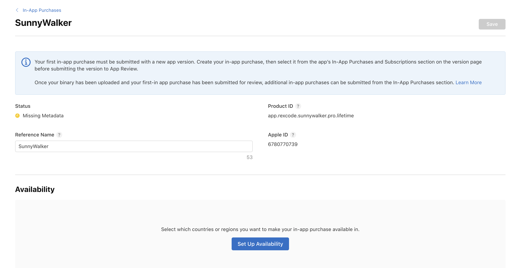
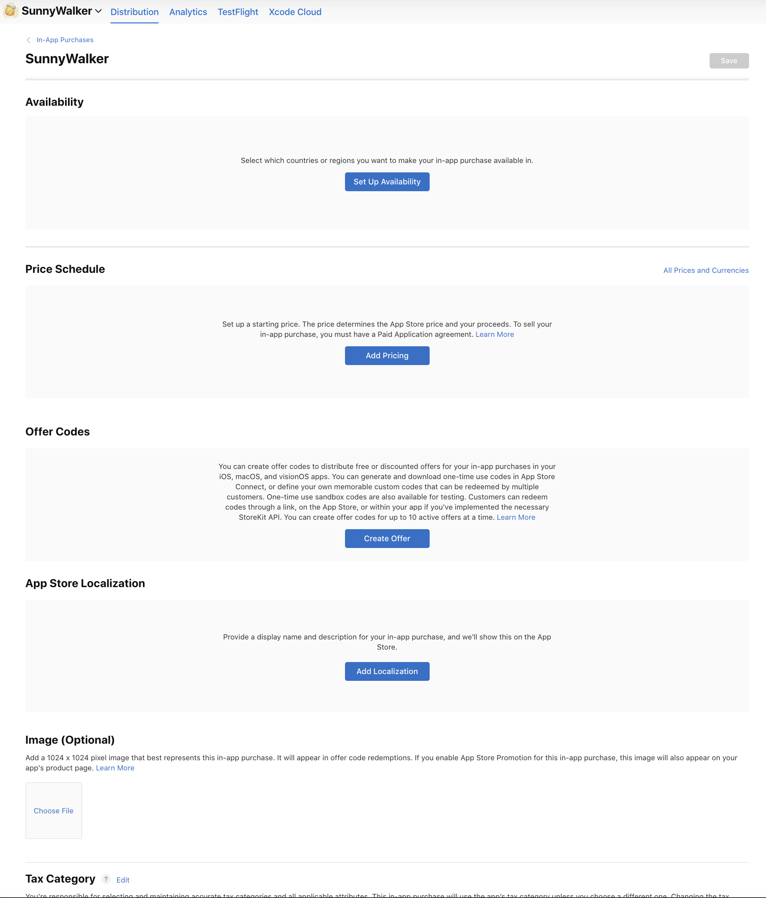
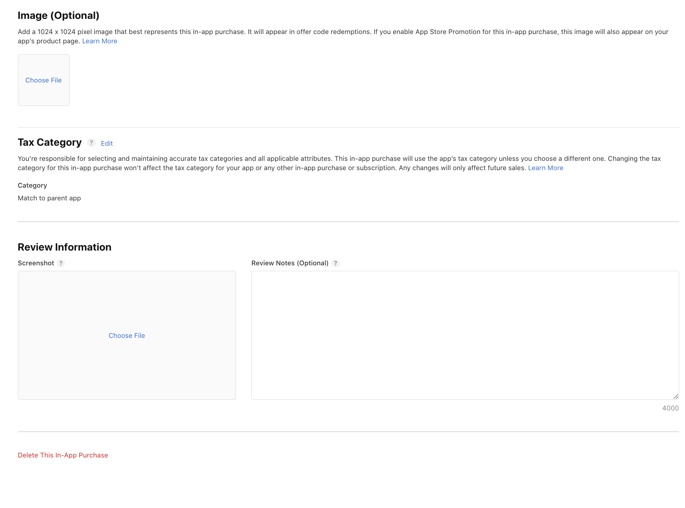

# IAP 頁面逐欄填寫指引（App Store Connect）

> 對象：SunnyWalker → Features → In-App Purchases → `SunnyWalker`（Non-Consumable）
> 值全部來自 `03.todo_Premium_Features_fable_260612.md` §4.3，**一字不差**。
> 目前 Status = **Missing Metadata**，把下面標 ✏️ 的欄位填完就會變綠。

---

## 截圖一：頁面最上方



| 欄位 | 怎麼填 |
|---|---|
| **Status** | 唯讀。現在是 🟡 Missing Metadata，填完下列欄位會自動轉綠。 |
| **Product ID** | 唯讀。`app.rexcode.sunnywalker.pro.lifetime` 已正確（與 code 常數一致，**存了不能改**）。 |
| **Apple ID** | 唯讀，Apple 自動產生（`6780770739`），不用動。 |
| ✏️ **Reference Name** | 目前是 `SunnyWalker`，**改成** `SunnyWalker Pro Lifetime`。純內部識別用、不對外顯示，但跟其他產品區分清楚比較好找。 |

---

## 截圖二：中段各區塊



### Availability ✏️（必填）
點 **Set Up Availability** → 選「**All countries or regions**」（全 175 storefronts；計畫就是台灣 base、其他由 Apple 換算）→ 存檔。

### Price Schedule ✏️（必填）
> ⚠️ 此處覆蓋計畫 §0/§4.3 的「台灣 NT$50 base」——Rex 2026-06-16 拍板改為**美金 $1.99 起賣**（$1.99 是 Apple 標準價格點，乾淨好選；$1.00 非經典整數階故不採用）。

點 **Add Pricing**：
- Base country/region = **United States**
- 價格 = **$1.99**（USD）
- 存檔後檢視自動換算值。以 $1.99 換算，**台灣約 NT$60**（高於原 NT$50，可接受）。若想台灣改別的數字，到 Price Schedule 把**台灣那一格手動微調**（單一 storefront，不影響其他國家）。

### Offer Codes（跳過）
本次不做折扣/促銷碼，**不要動**。

### App Store Localization ✏️（必填，兩個語言都要）
點 **Add Localization**，分別加：

**zh-Hant（繁體中文）**
- Display Name：`SunnyWalker Pro`
- Description：`終身解鎖：鬧鐘數量、自定鈴聲數量與長度、錄音長度全部無上限。一次購買，永久使用。`

**en（English）**
- Display Name：`SunnyWalker Pro`
- Description：`Lifetime unlock: unlimited alarms, unlimited voice clips, longer recordings. One-time purchase, yours forever.`

> 🔴 兩個語言都要填齊。漏一個語言 = Guideline 4「語言不一致」退件前科。

### Image (Optional)（可跳過）
1024×1024 圖，只用於 offer code 兌換頁與 App Store Promotion。本次沒開 Promotion → **可留空**。

---

## 截圖三：下半部



### Tax Category（不用動）
Category = **Match to parent app**，維持預設即可（沿用 app 既有稅務分類）。

### Review Information ✏️
- **Screenshot**（必填）：上傳 **ProUpgradeView 的截圖**（iPhone，購買頁原樣）。等 §3 的 UI 做好、在 simulator 或真機截一張即可。
- **Review Notes**（選填，但**建議填**，4000 字上限）：貼上預答 Guideline 2.1 的英文說明，預防再被問：

  ```
  The new in-app purchase (non-consumable "SunnyWalker Pro") is offered only inside the Settings area, which is always behind the parental gate (adult-level math question), per Guideline 1.3. Payment is processed entirely by Apple's StoreKit / In-App Purchase. The app still contains no third-party analytics, no third-party advertising, no data sharing, and collects no user or device data. All recordings and settings remain on-device.
  ```

### Delete This In-App Purchase
紅字危險鈕，**不要碰**。

---

## 這頁找不到、但別忘的兩件事

1. **Family Sharing = ON**
   不在這三張截圖裡（通常在產品設定的另一處 / 建立時的選項）。計畫拍板要開，⚠️ **開了不能關**。找到 Family Sharing 開關務必打開。

2. **送審必須隨 1.2 版一起**
   IAP 首次送審要綁某個 app version。把這個 IAP 狀態推到 **Ready to Submit**，並在 1.2 版送審時**勾選一起送**，否則 metadata rejected。

---

## 填完自我檢查

- [ ] Reference Name 已改為 `SunnyWalker Pro Lifetime`
- [ ] Availability = All countries or regions
- [ ] Price = United States **$1.99**（台灣自動換算約 NT$60；如需另定再手動微調）
- [ ] Localization：zh-Hant + en **兩個都建好**，Display Name / Description 與上方一字不差
- [ ] Review Screenshot 上傳（ProUpgradeView）
- [ ] Review Notes 貼上預答說明
- [ ] Family Sharing = ON
- [ ] Tax Category = Match to parent app（沒亂改）
- [ ] Status 由 Missing Metadata → 轉綠
- [ ] IAP 推到 Ready to Submit，1.2 送審時勾選隨附
