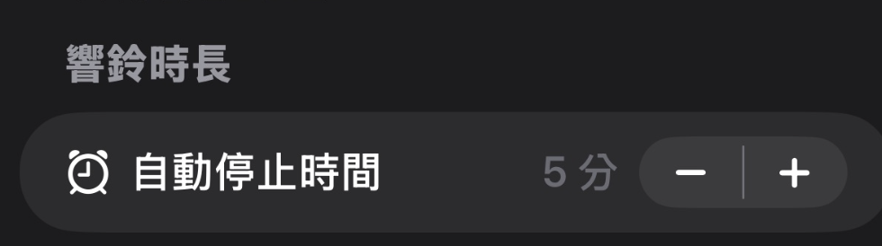
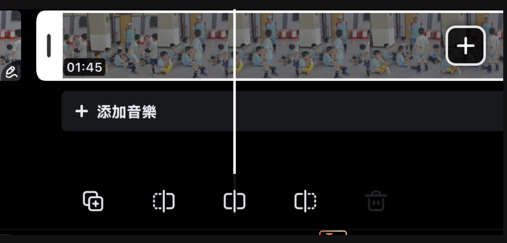
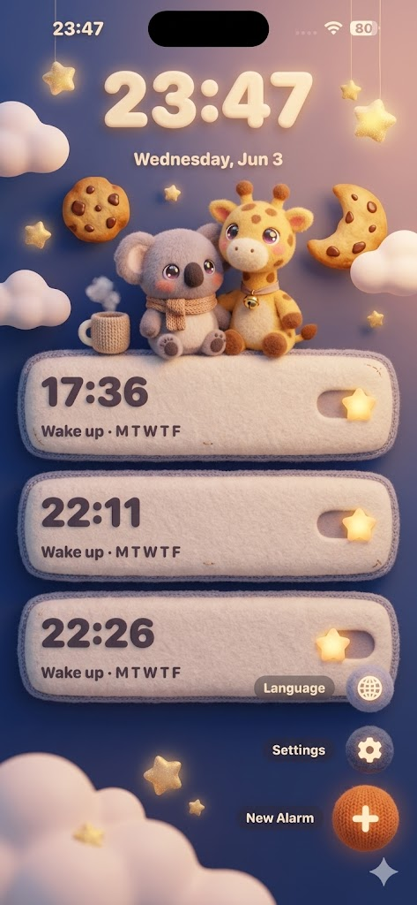
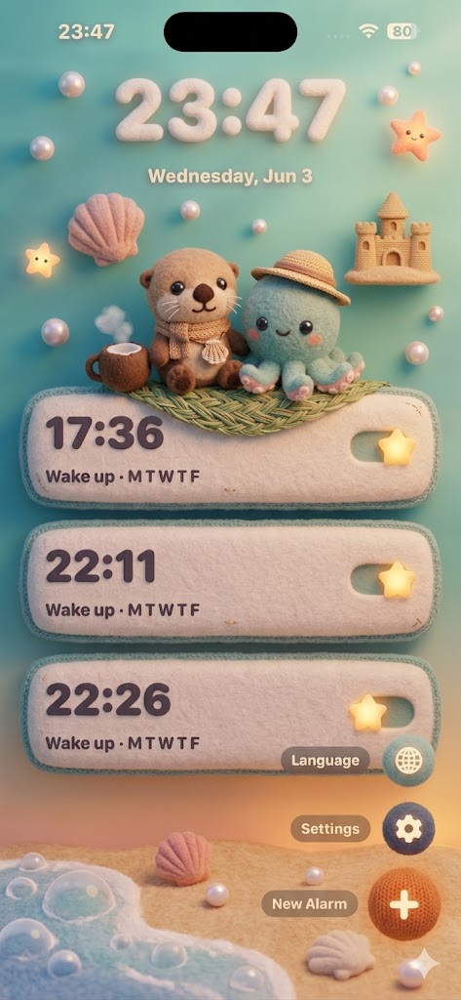

# 03_todo_fectures，完成後加 `done-YYYYMMDD_HHMM` 搬到 ## complete, fetures。

-----------------------------------------------------------------
## 吉卜力風格升級 — 技術規格（給 Sonnet 實作）  草案 2026-06-14

> 實作狀態：`done-20260614_2240`（本批核心完成）
> - 已完成：A1 紙紋理、A2 水彩卡片、A3 體積雲、A4 時段粒子、A6 遠山／前景植物、A7 三色色彩分級與過渡、B1 共用呼吸、B2 夜間狀態、B3 背景共用風、C 卡片時段圖示。
> - 已驗證：動畫集中於 `TimelineView + Canvas`、背景時暫停、Reduce Motion 靜態退化、裝飾層無障礙隱藏、無新增 asset、無碰觸 audio session。
> - 後續評估：A5 CoreMotion、A8 授權字型、B1 各 avatar 瞳孔／專屬動作、B4 彩蛋、B5/P2、C peek mascot。
>
> 目標：讓 SunnyWalker 從「可愛的扁平鬧鐘」進化成「會呼吸的吉卜力手繪世界」，更討小孩與家庭喜歡。
> 本次重點（Rex 指定）：**① 氛圍視覺打磨** + **② 會呼吸的世界**。聲音情境與起床儀式感先不做（另列 backlog）。
> 實作原則：**全部用程式生成（向量 / Canvas / SwiftUI shape）為主，盡量零美術素材**，維持現有「無 asset」哲學（見 `MascotView`、`SunnyAlarmAvatar` 的做法）。所有改動要尊重 `@Environment(\.accessibilityReduceMotion)`，動畫一律可被關閉（參考 `RewardView` 既有寫法）。
>
> ⚠️ 已知約束（來自 memory / CLAUDE.md）：語音 / 語音辨識相關功能只在前景可用，**本批視覺改動不得搶佔 audio session**（`MascotView` 已有註解說明錄音頁不可觸發 greet）。動畫改動只碰 render，不要動到 `AVAudioSession`。

### 0. 現況盤點（實際架構，先讀懂再改）
- 色票：`Theme/SunnyColors.swift` — 一個 `enum SunnyColors`，全是寫死的 `Color(red:green:blue:)`。目前是**乾淨但扁平**的色塊。
- 時段場景：`Views/Home/DaytimeScene.swift` — `enum DaytimeScene`（dawn/morning/noon/dusk/night），每個時段給一組 `gradientColors`（兩色線性漸層）與 `clockTextColor`。`HomeView` 每 60s tick 重算。
- 背景雲：`Views/Home/CloudBackground.swift` — 3 個半透明 `Ellipse`，各自 `easeInOut.repeatForever` 左右飄。**幾何感太強，不像手繪積雲**。
- 卡片：`Views/Components/WatercolorCard.swift` — 名字叫 watercolor 但其實只是 `RoundedRectangle` + 純色 fill + 陰影，**沒有任何水彩紋理**。
- 按鈕：`Views/Components/SunnyButton.swift` + `Theme/Animations.swift` 的 `ButtonPressStyle`（scale 0.92 spring）。
- 吉祥物：`Views/Components/MascotView.swift` — 向量繪製 5 款（sunnyAlarm / sunny / giraffe / bunny / bear），有 blink timer、tap bounce、tap-to-greet 語音。場景是 `SunnyAvatar`/`GiraffeAvatar` 等。
- 字型：`Theme/SunnyFonts.swift` — 全用 `.system(design: .rounded)`，註解已寫「之後換 registered custom font」。
- 動畫常數：`Theme/Animations.swift`（`snappy` / `cloudFloat` / `leafRustle` / `blink*` / `confettiBurst`）。
- 獎勵頁：`Views/Alarm/RewardView.swift` — confetti + 彈跳吉祥物 + 星芒，已正確處理 reduceMotion。

> 命名沿用：本規格新增的型別建議放進既有 `Theme/` 與 `Views/Home/` 群組，沿用 `Sunny*` 前綴，不要新開頂層資料夾。

---

### A. 氛圍視覺打磨（讓畫面像水彩手繪）

#### A1. 水彩紙紋理 + 顆粒 overlay（P0，CP 值最高）
**問題**：所有背景都是乾淨線性漸層，太數位、太扁平；吉卜力的底子是水彩紙的纖維與不均勻顏料沉積。
**做法**：
- 新增 `Theme/PaperTexture.swift`：一個 `PaperTextureOverlay: View`，用 **`Canvas`** 程式生成兩層：
  1. **紙纖維/顆粒**：在 `Canvas` 裡用固定 seed 的偽隨機（`var rng = SystemRandomNumberGenerator` 不行，要可重現 → 用 `GKLinearCongruentialRandomSource` 或自寫 LCG）灑 ~1500 個 0.5–1.5pt 的低透明度暗點/亮點，`blendMode: .overlay`，整體 `opacity(0.04~0.06)`。
  2. **顏料暈染**：3–5 個大型 `RadialGradient` 軟斑塊（半徑佔螢幕 30–60%），顏色取當前時段主色 ±10% 明度，`blendMode: .softLight`，`opacity(0.10)`，營造手刷不均。
- 用 `.drawingGroup()`（Metal flatten）包起來避免每 frame 重算；紋理是**靜態**的，只在時段切換時換色，不要每秒重畫。
- 套用點：`HomeView` 的 `background` ZStack 最上層（雲之下、內容之上的一層淡紋理），以及 `WatercolorCard` 內層。
- 驗收：截圖放大應看得到紙的顆粒感，但不干擾文字可讀性（WCAG 對比仍達標）。

#### A2. WatercolorCard 名實相符（P0）
**做法**：讓卡片真的有水彩感。
- 邊緣**不規則化**：把 `RoundedRectangle` 換成自訂 `Shape`，在 path 上加極小幅度的正弦抖動（amplitude 1–1.5pt），模擬手繪邊；或用 `RoundedRectangle` + `.overlay` 一條 `strokeBorder` 用半透明深色 + 輕微 `blur(0.5)` 做「顏料邊緣積色」。
- 內部填色改成 **`AngularGradient` 或雙色 `RadialGradient`** 取代純色，加 A1 的紙紋理 overlay，讓卡面有深淺。
- 陰影改柔：現在 `radius:12 y:4`，吉卜力偏柔擴散 → `radius:18, y:6, opacity 0.06`，並加一層極淡的 ambient occlusion（卡片四角內側微暗）。
- 保持 API 不變（`WatercolorCard(cornerRadius:) { content }`），只換內部實作，避免動到所有呼叫點。

#### A3. 體積感雲層（取代橢圓雲）（P0）
**問題**：`CloudBackground` 是 3 個 `Ellipse`，一眼看出是幾何。吉卜力的雲是層疊、蓬鬆、有受光面的積雲。
**做法**：
- 新增 `CloudShape: Shape`：用 4–6 個大小不一的圓相互交疊（union 概念）組成單朵「棉花積雲」的輪廓；底部平、頂部圓鼓。可用多個 `addEllipse` 疊一個 path。
- 每朵雲 = 主體（`SunnyColors.cloudWhite`）+ **受光頂緣**（偏白高光，往光源方向 offset 2–3pt）+ **陰影底緣**（時段主色混灰，opacity 0.15）。三層疊出體積。
- 數量增到 4–6 朵，**分前後兩層**做視差（見 A5）；後層更小更淡更慢。
- 飄移保留現有 `easeInOut.repeatForever`，但每朵加上極緩慢的「呼吸縮放」（scale 1.0↔1.03, 8–12s）讓雲在變形，不是剛體平移。
- 夜晚（`.night`）雲要壓暗並降透明（融進靛藍夜空），用 `DaytimeScene` 判斷。

#### A4. 大氣粒子層：光塵 / 螢火 / 落葉 / 花瓣（P1）
**問題**：畫面太乾淨、沒有「空氣」。吉卜力幾乎每個鏡頭都有飄浮微粒。
**做法**：新增 `Views/Home/AtmosphereLayer.swift`，依 `DaytimeScene` 切換粒子主題：
- **dawn / morning**：飄浮**光塵 dust motes** — 20–30 顆 1–2pt 暖白點，緩慢上飄 + 輕微水平漂移，opacity 隨 sin 呼吸；配一道斜向 **god ray（晨光光束）**：一個寬的白色 `LinearGradient` 長條，`blendMode:.softLight`、`rotationEffect`、極緩明滅。
- **noon**：減量光塵 + 偶爾飄過一兩片葉子。
- **dusk**：暖橘光塵 + 飄落葉（`leafRustle` 風格的旋轉下墜）。
- **night**：**螢火蟲 fireflies** — 10–15 顆暖黃點，各自走 Lissajous/隨機漫遊路徑，亮度脈動（fade in/out 2–4s），偶爾短暫拖尾。星星（既有 starGold）可加微弱閃爍。
- 實作建議用 **`TimelineView(.animation)` + `Canvas`** 一次畫所有粒子（效能遠勝幾十個獨立 `View` + `repeatForever`）。粒子狀態用簡單結構陣列，在 closure 內依 `timeline.date` 算位置。
- `reduceMotion` 時：粒子靜止或直接隱藏；至少不要漂移。
- 套用點：`HomeView` ZStack，介於 `background` 與內容之間（screen-reader 設 `.allowsHitTesting(false)` + `.accessibilityHidden(true)`，比照 `CloudBackground`）。

#### A5. 視差景深（多層場景）（P1）
**問題**：目前是平面背景 + 內容，沒有「往畫面深處看」的層次。
**做法**：把首頁背景拆成可前後位移的圖層，回應裝置傾斜：
- 圖層由遠到近：天空漸層 → 遠雲（A3 後層）→ god ray / 遠山剪影 → 近雲（前層）→ 前景植物（A6）。
- 用 **`CoreMotion`（`CMMotionManager`）** 讀 roll/pitch，給每層不同係數的 `offset`（遠層位移小、近層位移大，幅度上限 ±8–12pt，spring 平滑）。包成 `ParallaxLayer` modifier。
- 必須容錯：模擬器 / 無 motion 權限 / `reduceMotion` → 全部係數歸零，靜態呈現。CoreMotion 在背景要停（省電，且呼應「前景才動」原則）。
- 注意這是 SwiftData + 既有 `scenePhase` 流程，motion manager 要在 `.onDisappear` / `.background` 停掉，避免洩漏。

#### A6. 前景植物與遠山剪影（P1）
**做法**：在 `HomeView` 底部加一層 `ForegroundFlora`：
- 幾叢手繪風草、蕨葉、或小花的向量剪影（半透明深綠 `forestDeep`），貼齊畫面下緣，被風吹時用 `leafRustle` 做輕搖（每叢相位錯開）。
- 遠處一道柔和**遠山/森林剪影**（單色 + 邊緣 blur），墊在雲層後，強化景深與「繪本場景」感。
- 隨 `DaytimeScene` 換色：晨綠、午亮、昏橘、夜深藍剪影。

#### A7. 時段色彩分級升級（P0，低成本高回報）
**問題**：每時段只有兩色線性漸層，色域偏「亮 app 配色」而非吉卜力的溫潤、略帶灰調的膜感。
**做法**：
- 把 `DaytimeScene.gradientColors` 從 2 色擴成 **3 色漸層**（天頂深、地平線暖、中段過渡），用 `LinearGradient` 多 stop。
- 整體疊一層極淡的**暖色濾鏡**（`lanternOrange.opacity(0.05)`，`blendMode:.softLight`）統一色調，這是吉卜力「同一塊玻璃看世界」的關鍵。
- 新增 **dawn↔morning↔...↔night 的平滑過渡**：目前是 60s tick 硬切。改成在跨時段邊界用 `withAnimation(.easeInOut(duration: 1.5))` crossfade 兩組漸層（用 `.opacity` 疊兩個 gradient view 切換），避免整點「啪」一下變色。
- 進階（P2）：在時段內依精確分鐘做微插值（如 18:00→19:00 逐漸轉暗），讓黃昏是連續變化。

#### A8. 手繪感字體（P1）
**問題**：`SunnyFonts` 全 system rounded，乾淨但無個性；吉卜力片頭與繪本是手寫/楷書感。
**做法**：
- 中文：選一款**圓潤手寫/楷體授權字型**（需確認商用授權，建議開源如「源樣黑體圓/ 台北黑體 / jf open 粉圓」之類可商用者），用 `UIFontPickerViewController` 流程或直接 bundle `.ttf` + Info.plist `UIAppFonts` 註冊。
- 數字時鐘（`SunnyFonts.clock`）可考慮用較有手感、但仍清楚易讀的字（時鐘要優先可讀性，別為風格犧牲）。
- `SunnyFonts` 已預留 swap 點（註解明寫），只要改 `enum` 內各 helper 回傳 `.custom(...)` 並保留 system fallback。
- 標題（`title`）用手寫感、內文/設定用 rounded，混搭避免閱讀疲勞。
- 驗收：小孩易讀、家長覺得有溫度；繁中字型缺字要 fallback。

---

### B. 會呼吸的世界（讓場景與吉祥物像活著）

#### B1. 吉祥物「微行為」系統（P0，最有感）
**問題**：吉祥物目前只有 blink timer + tap bounce，idle 時偏靜。活生生的角色會呼吸、東張西望、偶爾打哈欠。
**做法**：在 `MascotView` 層級加一個共用的 `MascotIdleBehavior`（可用一個 `@StateObject` driver 或 `TimelineView`）：
- **呼吸**：整體 `scaleEffect` 在 y 軸做 1.0↔1.02 的 4s 緩慢起伏（像胸口起伏），所有款式共用。這一條就能讓角色立刻「活」起來。
- **隨機掃視**：眼睛（各 avatar 的 `eye`）偶爾左右看 — 在現有 blink 機制旁加一個 5–9s 隨機的 pupil offset（±2pt），看完回正。
- **偶發小動作**：每 12–20s 隨機挑一個 micro-gesture：歪頭（`rotationEffect` ±5°）、耳朵抖（bunny）、伸懶腰、打哈欠（嘴張開的 avatar 才做）。用權重隨機，避免規律。
- **回應點擊**：保留 tap bounce + greet，再加「被戳到會短暫睜大眼/臉紅」反應。
- 全部尊重 `reduceMotion`：關閉時只保留最小幅度呼吸或完全靜止。
- 架構建議：把這些 idle 狀態抽成一個 `ObservableObject`（timer 集中管理，避免每個 avatar 各開一堆 `Timer.publish` 造成 5 款各自重複）。現在 sunnyAlarm 已有 blink+ring 兩個 timer，統一到 driver 較好維護。

#### B2. 吉祥物隨「時段」改變狀態（P0）
**問題**：不管白天黑夜，吉祥物都一樣。會呼吸的世界應該知道現在幾點。
**做法**：把 `DaytimeScene`（或當前 hour）傳進 `MascotView`：
- **night**：吉祥物想睡 — 眼睛半閉、偶爾點頭打盹、頭上飄 z z z（小 `Text("z")` 上飄淡出）。
- **dawn**：剛睡醒 — 揉眼睛、伸懶腰動作機率提高。
- **morning / noon**：精神最好 — 呼吸頻率高一點、微笑、偶爾蹦一下。
- **dusk**：放鬆、動作放慢。
- 顏色/腮紅也可隨光線微調（夜晚整體降明度、加冷色調，呼應 A7 的統一濾鏡）。
- 注意：這是視覺狀態，**不要**和真正鬧鐘響鈴邏輯耦合。

#### B3. 場景元素互相回應（P1）
**做法**：讓背景元素之間有「風」這個共同變數：
- 定義一個全域緩慢變化的 `windPhase`（`TimelineView` 提供，或一個輕量 `WindModel: ObservableObject` 每 frame 更新一個 -1…1 值）。
- 雲飄速、前景草搖、落葉飄向、吉祥物頭髮/耳朵擺動**共用同一個 windPhase** → 整個畫面像被同一陣風吹過，這是「世界感」的關鍵，比各自亂動高級很多。
- 風偶爾來一陣強的（gust）：草大幅彎、葉子被捲起、雲加速 1–2s，然後回穩。

#### B4. 點擊互動小彩蛋（P1，討小孩喜歡）
**做法**：把首頁變成可以玩的「活繪本」，但**不干擾鬧鐘主功能**：
- 點雲 → 雲飄散一下再聚回 / 飄出一顆小雨滴或彩虹。
- 點太陽/月亮 → 短暫發光脈動。
- 點前景草叢 → 驚起一隻小鳥/蝴蝶飛過畫面（一次性 `Canvas` 動畫）。
- 連點吉祥物 N 次 → 解鎖隱藏表情/小慶祝（呼應 `RewardView` 的歡樂語彙）。
- 所有彩蛋都是純視覺、無狀態副作用，且 `allowsHitTesting` 不可蓋到鬧鐘卡片/FAB 的點擊區（注意 z-order 與命中測試）。
- 觸覺：互動加 `UIImpactFeedbackGenerator(.soft)` 輕回饋（小孩很吃這套），但要可在設定關閉。

#### B5. 鬧鐘卡片「活」起來（P2）
**做法**：`AlarmListView` 的卡片目前靜態。
- 啟用中的鬧鐘卡片：對應的小圖示有極輕微 idle（上學鬧鐘旁的小書包微晃、午睡的月亮微亮）。
- 卡片出現/刪除用更柔的 spring + 輕飄入場（從下方淡入上浮 6pt），呼應整體手繪溫柔調性。

---

### C. 長清單／多鬧鐘情境（10+ 個鬧鐘）— 別讓世界「捲走」

**問題**：`HomeView` 是單一 `List`，header（時鐘＋`MascotView`）是第一個 scroll row。設很多鬧鐘往下捲時，**吉祥物會整個捲出畫面**，只剩一疊重複的水彩卡，吉卜力的「世界感」被稀釋。
**好消息**：天空漸層 `background` 與 `CloudBackground()` 是 `HomeView` ZStack 的**固定背景**（List 設了 `scrollContentBackground(.hidden)` + 透明 row），所以捲動時天空/雲會留著。
**前提**：free 上限 6（`FeatureLimits.maxAlarms`），10 個＝Pro（多寶寶／上學・午睡・才藝・睡前多情境）。這正是要讓 Pro 畫面「物有所值」之處。

做法（P1）：
1. **大氣層放固定背景，不要放 header**：A4 `AtmosphereLayer`、A3 雲、A4 god ray 一律放進 `HomeView` ZStack 的背景層（和 `CloudBackground` 同層），**絕不可**塞進 List 的 `header` row，否則捲動時整個世界會跟著消失。驗收：捲到第 10 張卡，天空仍在呼吸、粒子仍在飄。
2. **吉祥物不缺席（peek mascot）**：偵測 header 是否捲出可視範圍。**本專案 deployment target 已是 iOS 26**（AlarmKit 需求，見 `project.yml`），所以直接用 `onScrollGeometryChange(for: CGFloat.self) { $0.contentOffset.y }` 監看捲動量即可，不必做舊版 `GeometryReader`+preferenceKey 的 fallback。header 一離開就在角落（雲後探頭／蹲在 FAB 旁）**淡入一隻迷你吉祥物**，維持 B1 呼吸＋偶爾眨眼；捲回頂端再淡出。讓「角色」永遠在場。peek 與 header 的 mascot **共用同一個 B1 idle driver**，不要各開 timer。
3. **卡片視覺節奏（破解「試算表感」）**：每張卡左側加一個**隨該鬧鐘時間變化的小手繪圖示**（晨＝朝陽、午＝向日葵、傍晚＝燈籠、夜＝月亮），卡片暖色調依時段微調，讓 10 張卡讀起來像「一天的時間軸」而非清單。入場用 stagger（每張延遲 ~0.03s 上浮淡入，呼應 B5）。
4. **時段分組（可選 P2）**：鬧鐘按 早晨／下午／傍晚／夜晚 分段，段首一條手繪細線＋小標（楷體字）。多情境家庭一眼分群。注意 `@Query` 目前依 hour/minute 排序，分組可在 view 層 group by 時段，不必動 model。
5. **捲動微互動（P2）**：捲動時雲做輕微視差位移、吉祥物離場前揮手、peek 狀態看著你捲。純視覺、無副作用。

效能（10+ 卡 + 動畫並存，務必）：
- 動畫**集中在單一 `TimelineView(.animation)` 背景層**，`List` 的 row（`AlarmCard`）保持輕量、**不可**各自跑 `repeatForever`（現在 `AlarmCard` 無動畫，維持）。
- peek mascot 出現/消失判斷要**節流**，不要每 frame 重算 scroll offset。
- 卡片入場 stagger 只在「首次出現」跑一次，捲動 reuse 時不要重觸發。

### 實作順序建議（給 Sonnet）
1. **第一波（最高 CP，先做）**：A1 紙紋理 → A7 色彩分級+平滑過渡 → A2 WatercolorCard → B1 呼吸/微行為 → B2 時段狀態。這五項不需新權限、風險低、視覺提升最明顯。
2. **第二波（景深與空氣）**：A3 體積雲 → A4 粒子層 → A6 前景植物 → B3 共用風 → B4 互動彩蛋。
3. **第三波（需評估）**：A5 CoreMotion 視差（要權限/容錯）→ A8 自訂字型（要授權確認）→ B5 卡片微動。

### 共通技術注意事項（務必遵守）
- **效能**：所有重複動畫優先用 **單一 `TimelineView(.animation)` + `Canvas`** 集中繪製，避免幾十個 `repeatForever` 的獨立 View（會吃 CPU/電）。粒子、雲、風都走這條路。
- **省電 / audio**：動畫不得碰 `AVAudioSession`；CoreMotion 與粒子在 app 進背景（`scenePhase != .active`）要暫停。呼應「前景才動」的既有約束。
- **無障礙**：每個動畫都要查 `@Environment(\.accessibilityReduceMotion)`，關閉時退化成靜態或最小幅度（照抄 `RewardView` 的模式）。裝飾層一律 `.accessibilityHidden(true)` + `.allowsHitTesting(false)`。
- **零素材優先**：能用 `Shape`/`Canvas`/向量畫出來就不要進點陣圖；維持現有無 asset 哲學，APK/IPA 不變胖。
- **不破壞 API**：`WatercolorCard`、`SunnyButton`、`MascotView`、`SunnyColors`、`SunnyFonts` 的對外介面盡量不動，只換內部實作，降低 regression。
- **iPad / 橫向**：`HomeView` 已分 iPhone 單欄 / iPad 雙欄 / 橫向，新圖層要在三種布局都測（粒子別蓋到右側鬧鐘清單）。
- **自檢 & lore（CLAUDE.md 要求）**：開工前 `vein_brief()` + `vein_recall("swift ios animation timelineview canvas performance")`；改完對 `git diff` 逐條比對雷區，發現新雷用 `vein_log("pitfall"/"decision", ..., tags=["project:sunnywalker","swift"])` 寫回。

### 附錄：預覽 demo 的實測參數（直接拿去調，省去猜值）
> 以下數值來自 2026-06-14 兩支 HTML/Canvas 預覽（「會呼吸的場景」＋「10 鬧鐘捲動 peek」）。是**已調過、看起來對的起始值**，translate 到 SwiftUI 後在真機微調即可。所有 px 以 300×540 的手機畫布為基準，換算成實際螢幕用比例。

#### 1. 色票（沿用 `SunnyColors`，新增的請補進 enum）
| 用途 | Hex | 對應現有 |
|---|---|---|
| 天空頂（晨） | `#7FBFD8` | skyBlue 加深版（新增 `skyDeep`） |
| 天空中（晨） | `#9ED1E8` | `skyBlue` |
| 天空底/地平線（晨） | `#FAF8ED` | `cloudWhite` |
| 雲體亮面 | `#FCFAF0` | cloudWhite 提亮 |
| 雲底陰影 | `#E1DECD` 半透明 | 由時段主色 ×0.8 動態算 |
| 暖色分級濾鏡 | `#F3C75C` @ **soft-light, alpha 0.06**（晨）/ `#ED8C4F` @ 0.10（昏）/ 冷色 `rgb(120,140,210)` @ 0.08（夜） | A7 |
| 時鐘字（日/夜） | `#2E366B` / `#FCF2BD` | nightIndigo / starGold |

時段三色漸層 stop 位置：`[0.0, 0.55, 1.0]`。
晨/昏/夜的三色組（top/mid/bot）：
- 晨 `#7FBFD8 / #9ED1E8 / #FAF8ED`
- 昏 `#E07B3E / #ED8C4F / #F3C75C`
- 夜 `#232A55 / #2E366B / #3D478A`

時段切換 crossfade：色彩用 `approach(cur,target, dt*2.2)` 線性逼近（≈ 1.2–1.5s 到位），對應 `withAnimation(.easeInOut(duration:1.5))`。

#### 2. 吉祥物（sun-clock mascot，viewBox 132×150，中心 (66,78)）
> ⚠️ 下表的幾何座標是**預覽 demo 重畫版**的值。真機已有 `SunnyAlarmAvatar`（`MascotView.swift`），它自己的座標不同（花瓣 `offset(y:-50)`、雙眼 `HStack(spacing:20)`、鈴鐺 ring `4°` + `repeatCount(6)`）。**請在既有 `SunnyAlarmAvatar` 上改**，只新增「呼吸 / 掃視 / 夜晚想睡」這幾個行為，**不要**照 demo 座標重畫整隻。下面的動畫時間/幅度才是要採用的重點。
| 動作 | 參數 |
|---|---|
| 呼吸 | `scaleY` 1.0↔1.03，週期 **4s** ease-in-out，origin = 中心底部（`transform-box: fill-box`） |
| 眨眼 | 眼睛 `scaleY` 1.0→0.1，blink 佔週期 ~4%，整體週期 **4.2s** |
| 鈴鐺 idle ring | `rotate` ±3°，週期 **3s** ease-in-out，origin = 底部 |
| 夜晚想睡 | 眼睛開度 ×0.45、嘴改小弧、加 `rotate` 點頭 sin(t·1.1)×0.05、隨機冒 z（life 2.2s 上飄淡出，最多 6 個，spawn 機率 ~0.02/frame） |
| 夜晚變暗 | 全色 ×0.66（晨 1.0、昏 0.92） |
幾何重點：12 花瓣（`rect 14×26 rx7`，中心往上 offset −72，每 30° 一片）；錶身 3 圈（r52 goldDeep .55 / r48 gold / r40 cream）；12 刻度（`3×7 rx1.5`，offset −36）；眼睛 `10×14 rx5`，間距中心 ±10；腮紅 r6 @ (±15,7)；腳 `20×13 rx6` @ (±13,62)。

#### 3. 雲層 / 粒子 / 大氣（密度照抄）
| 元素 | 數量 | 關鍵參數 |
|---|---|---|
| 雲 | **5–6 朵**（前 3 / 後 2–3 分層） | lump = 6 個交疊橢圓 `[[0,0,24][18,4,18][-18,4,17][9,-7,16][-9,-6,15][32,7,12]]×s`；scale 0.55–1.25；漂速 5–14 px/s；夜晚 alpha ×0.45 |
| 雲視差（捲動） | — | `cloudY -= scrollTop × 0.03` |
| 光塵 dust（晨/昏） | **24–30 顆** | r 0.7–2.2；上飄 vy 4–8 px/s；水平 wobble 8–14；亮度 `0.3+0.5·|sin|` 呼吸 |
| 螢火 firefly（夜） | **14 顆** | Lissajous 漫遊 ax 20–60 / ay 14–44，freq 0.3–0.8；亮度脈動 + 外圈 alpha 0.25 光暈 r6 |
| 星星（夜） | 26 顆 | r 0.6–1.8；`tw = 0.4+0.6·|sin(t·1.4+ph)|` 閃爍 |
| god ray（晨/昏） | **3 道** | 斜向平行四邊形，`blendMode soft-light`，alpha `ray·(0.5+0.5·sin(t·0.6+i))·0.5`，昏 ray 0.35、夜 0 |
| 紙紋理 grain | ~1400–2400 點 | 每點 alpha 0.04–0.10，`blendMode overlay`，整層再 alpha **0.45**；**靜態預算一次** offscreen，每 frame 只 drawImage |
| 共用風 windPhase | — | `sin(t·0.5)+0.4·sin(t·1.3)`，雲飄、草搖、葉向共用同一值 |

> SwiftUI 對應：粒子＋雲＋god ray 全部畫在**單一 `TimelineView(.animation)` 內的一個 `Canvas`**（`context.blendMode = .softLight/.overlay`）。紙紋理用 `Image(uiImage:)` 預算一次。

#### 4. 卡片清單（時間軸式）
| 時段 | 卡片底色 tint | 圖示 |
|---|---|---|
| morning | `#EAF4F7` | 朝陽（圓 + 8 道光芒） |
| noon | `#FBF6E6` | 向日葵（10 花瓣 + 棕心） |
| dusk | `#FBEFE2` | 燈籠（橘罐 + 暖光） |
| night | `#ECEDF6` | 月亮（碗月，用 tint 色挖一刀做月牙） |
- 時間字 `700 30px` `#2E366B`；副標 `500 13px` `#6B6B73`；卡片圓角 18、padding 13/14、間距 9、陰影 `0 3px 10px rgba(60,50,30,.06)`。
- 入場 stagger：第 i 張 `animation-delay = i × 0.04s`，`opacity 0→1 + translateY 10→0`，0.5s ease，**只在首次出現跑一次**。
- 關閉的鬧鐘：整卡 opacity **0.55**；toggle 開=`#8FBC72`(leafFresh)、關=灰。
- 時段判斷：依鬧鐘 hour 走 `DaytimeScene.current(hour:)` 同一套邊界（5/7/11/15/19）。

#### 5. peek mascot（捲動觸發）
| 參數 | 值 |
|---|---|
| 觸發點 | `scrollTop > 170px`（≈ header 高度；真機用 `onScrollGeometryChange` 抓 header 底部離開可視區） |
| 尺寸 | 主吉祥物的 **0.46×**（約 60×62） |
| 位置 | 右上角 top 10 / right 12，下方墊一小片半透明雲 `rgba(250,248,237,.9)` 橢圓做「探頭」 |
| 淡入淡出 | opacity + `translateY(-8→0)`，**0.45s** ease |
| idle | 與主吉祥物**共用同一個 B1 driver**（呼吸＋眨眼），不要另開 timer |

> 固定背景層（天空/雲/粒子/grain）放 `HomeView` ZStack 背景，**不可**放進 List header —— 這是 C 節的關鍵，否則捲動時世界會一起消失。

### Backlog（本批不做，Rex 未選的方向）
- 聲音情境層：隨時段的環境音（晨鳥/風/午後蟬/夜蟲）、吉祥物配音、起床魔法音效。
- 起床儀式感：叫醒→完成的電影化流程、收集圖鑑、季節變化、晨間驚喜。
- 這兩塊可與「會呼吸的世界」共用 windPhase / DaytimeScene driver，未來接起來成本低。

-----------------------------------------------------------------
## 新增鬧鐘頁

-----------------------------------------------------------------
## 付費版（Pro）規劃 — 草案 2026-06-08

### 1. 目前免費版上限（已實作，集中在一個開關）
所有「可收費的限制」已收斂到單一來源：`SunnyWalker/Services/AppSettings.swift` 的 `enum FeatureLimits`。
未來上 Pro 只要把 `isPro` 接到 StoreKit 購買狀態、翻成 `true`，下面所有上限自動解除，不用改各頁面。

| 項目 | 免費版 | Pro |
|---|---|---|
| 鬧鐘數量 | 6 個 | 無限 |
| 自定鈴聲（錄音庫）數量 | 5 段 | 無限 |
| 單段自定鈴聲長度 | 5 秒 | 30 秒 |
| 每個鬧鐘的家長語音長度 | 3 分鐘 | 無限 |

呼叫點都只是轉接到 `FeatureLimits`：`HomeView.maxAlarms`、`VoiceClipLimits.maxCount/maxDurationSeconds`、`AudioRecorder.maxRecordingSeconds`。
→ Code review 時看 `FeatureLimits` 一個 enum 就能掌握整個 free/paid 邊界。

### 2. 收費模式建議：以「買斷」為主
理由：
1. 這是工具型 app（鬧鐘），不像教育內容會持續產新教材，訂閱很難說服家長長期付費、退訂壓力大。
2. 家長對兒童 app 的「freemium 釣魚／訂閱陷阱」特別反感；一次買斷解鎖反而建立信任、口碑好。
3. 我們沒有伺服器／內容成本，買斷的邊際成本趨近 0，毛利高。

主推 **一次性解鎖 Pro（買斷、永久、可跨裝置 Restore）**。

### 3. 建議定價（台灣 App Store）
- 上架首兩週 **早鳥價 NT$90**（約 US$2.99），之後回到 **NT$120**（約 US$3.99）。
- 想要經常性收入，可同時提供「Pro 年訂閱 NT$120/年」當**次要**選項，但把買斷放最顯眼，避免被當訂閱陷阱。
- 心理定價：NT$120 ≈ 一杯手搖飲，對「每天叫小孩起床」這個痛點門檻極低。
- 對照市場：教育類訂閱多落在 US$8–12/月、年約 US$89；我們是單純工具，定價要遠低於此，買斷 US$3–5 最合理。

### 4. Pro 的吸引力（賣點）
除了解除上面四個上限，建議再把這些做成 Pro 專屬，讓「解鎖」更有感：
- **無限鬧鐘 + 無限自定鈴聲**：多寶寶家庭、多情境（上學／午睡／才藝課）一次設好。
- **更長的家長語音**：可錄完整的叫醒話／故事／兒歌（免費 3 分鐘 → Pro 無限）。
- （未來）**更多吉祥物 / 主題 style**：把森林繪本、星夜棉花糖、海風沙灘部分設為 Pro 限定，或新增 Pro 限定款。
- （未來）**進階起床統計**：週／月報表、準時率趨勢、匯出。
- （未來）**家長專區**：多裝置同步、匯入匯出鬧鐘設定。

情緒勾子：主打「**一次解鎖，全家、長期都好用**」，而不是按月扣款。

### 5. 上架 / App Store 注意（兒童類別）
- 若放 **Kids 類別**，Apple 規定 IAP 必須在**家長閘門後**才能購買 —— 我們已有 `ParentalGateView`，把「升級 Pro」按鈕放它後面即可合規。
- 不可有誘導兒童消費的 UI；購買入口、價格說明全走家長端。
- 一次性解鎖必須支援 **Restore Purchases**（換機／重裝還原）。

### 6. 落地步驟（之後做）
1. 接 StoreKit 2：一個 non-consumable product（如 `com.sunnywalker.pro`），購買成功 → 寫入 entitlement → `FeatureLimits.isPro = true`。
2. 把 `FeatureLimits.isPro` 從寫死 `false` 改成讀購買狀態（目前已預留成 `static var`）。
3. 在「鬧鐘已達 6／錄音已達 5」等上限提示加「升級 Pro 解除」CTA，導向家長閘門 → 購買頁。
4. 設定頁家長工具區加 Restore Purchases。

-----------------------------------------------------------------
## complete, fetures

### done-20260607 新增鬧鐘頁 — 鈴聲分兩列 + 口令提示優化
- `AlarmEditorView` 鈴聲卡片拆成「內建鈴聲」＋「自定錄音」兩列，各有 checkmark 標示當前選擇。
- 切到內建時自動清除 recordingName（讓口令關閉 toggle 自動 disable）。
- `RingtonePickerSheet` 新增 `RingtonePickerMode`（`.bundled` / `.custom` / `.all`），各自只顯示對應 section；`.custom` 無錄音時顯示引導空狀態。
- 口令關閉提示文字改為「先在『自定錄音』選一個鈴聲，才能開啟口令關閉。」

### done-20260606_2031 bug fix, setting中，自動停止的時間無效
- 修正 AlarmRingView 開啟時接手並停止底層系統鬧鐘，避免自動停止時間看起來失效。
- 修正背景響鈴 timeout 到時會一併停止系統鬧鐘。

### done-20260606_2031 優化錄音檔頁
- 每段錄音可點進詳情頁，支援重新命名、刪除、顯示長度與 size、分享至其他 App。
- 新增裁剪功能，可裁左、裁右後直接存回原錄音。

### done-20260606_2031 再設計幾款可選的 style
- 新增 `森林繪本`、`星夜棉花糖`、`海風沙灘` 三種可切換 style。
- 已套用到首頁背景、卡片、設定頁、錄音頁與鬧鐘響鈴頁。

