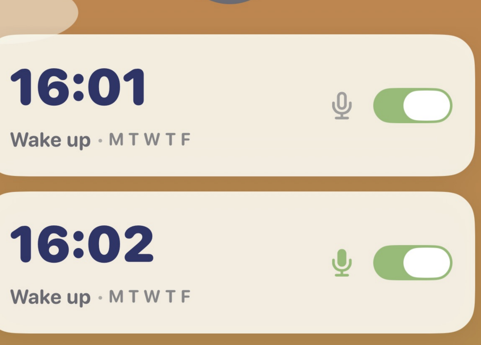

# 03_todo_fectures 

> 新功能 / UX polish 收件匣。完成後加 `done-YYYYMMDD_HHMM` 搬到
> `03_todo_fectures_done.md`。

## setting中的Language刪除(首頁已有)

## 家長識別在按setting時出現就好，setting中的所有選項，不需要再出現 

## 移除app主頁上鬧鐘的麥克風錄音(用 setting中的管理就好)

## 能再做一個長頸鹿的主題嗎(可以的話在setting中允許設定 )
