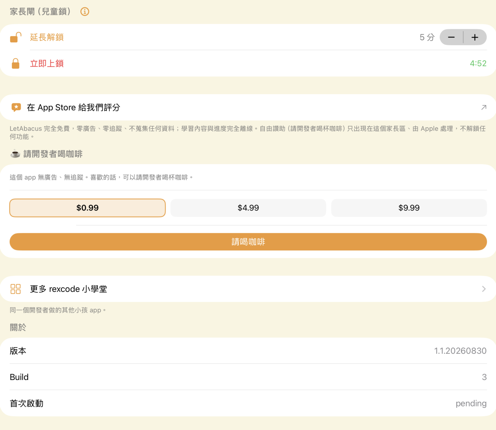

# 03_todo_fectures，完成後加 `done-YYYYMMDD_HHMM` 搬到 ## complete, fetures。

## complete, fetures

### done-20260903_0140 區間報時（起／迄／間隔 + 內建人聲男女 + 試聽，報時次數保留）
- 報時群組的鬧鐘改用 `ChimeCardView`：區間開關、迄時刻、間隔（1/2/3/5/10/15/20/30 分）、人聲（女／男，
  該語言沒裝男聲會說明去哪下載）、報時次數、試聽。卡片即時列出會報的時刻（07:00、07:05 … 07:25 · 共 6 次），
  迄本身不報（照原需求「7:00 囉 … 7:25 囉」）。
- 每個時刻各合成一句 CAF（`ChimeSoundComposer.composeSlots`，全成功才換檔）；排程走 `AlarmScheduler.scheduleChime`：
  七天都勾 → 每時刻 1 顆每日重複通知；部分星期 → 時刻 × 星期；連報 N 次為每時刻補一次性通知。
  額度（iOS 64 顆）先給時刻再給連報，時刻上限 12 個。
- 首頁卡片顯示「07:00–07:30 · 每 5 分」。model 新欄位全 optional（SwiftData 輕量遷移）。
- 21 個新單元測試（時刻展開、通知 id、URL 請求、首頁「下一個」）。

### done-20260903_0140 選音檔／錄音頁滑動頓、偶爾 crash
- 三條主執行緒 I/O 全搬背景：選錄音當鈴聲的 CAF 匯出、錄完自動匯出、App 更新後的自癒重匯出。
- 錄音列的檔案大小改成進列讀一次（以前每次捲動每列 stat 一次）。
- 首頁三層動畫被 sheet 蓋住時暫停（`SheetPresenceTracker`）。
- SwiftData 已刪物件過濾（`isDeleted`）＋刪除前先放掉詳情 sheet 參照——這是「有時整個 crash」最可能的根因。
- 接上共用件 `KidsDiagnostics`（MetricKit）：下次架上版閃退，`Documents/diagnostics/` 會有 crash/hang JSON 可拉。
- ⚠️ 架上版（1.3 b17）沒有 crash log 可對照，以上是 code review 推斷 + 修法；真因要靠下一版的 diagnostics 確認。

### done-20260903_0140 家長模式對齊 common_lib_ios（請喝咖啡的位置＝Pro 購買）
- common_lib_ios `KidsParentFooter` 新增 `proRow: KidsProRow?`（加在打賞段的位置；已解鎖只顯示靜態列）。
  可選參數、預設 nil，其他 14 個 app 不受影響。
- SunnyWalker 設定頁改用尾段的家長閘段（延長解鎖／立即上鎖），刪掉自家的「暫時解鎖」與「Pro」段；
  共用 session 的解鎖狀態鏡射回 AppSettings（首頁「＋」／設定鈕跟著免驗證）。
- `SettingsView` 從 HomeView.swift 搬出成獨立檔。

### done-20260903_0140 首頁一堆鬧鐘怎麼整理
- 卡片左側改「種類」圖示（鬧鐘／報時／待辦一眼分得出）、星期改「每天／平日／週末」縮寫或 7 顆小圓點、
  今天接下來最先響的那顆標「下一個」。
- 排列三選一（設定 › 首頁清單 › 排列方式）：依時間／依時段（早上・上午・下午・晚上）／依星期。
  舊的「依星期分組」開關自動遷移。

### done-20260903_0140 整體 review + 簡化
- 見 `docs/code_review_260903.md`：路徑／通知 id／CAF 寫檔的唯一正本、順手修掉「刪鬧鐘後切段通知還在響」的 bug、
  下一輪清單（群組平行陣列、dormant 的背景聆聽、貪睡殘骸、EditorSnapshot 三處同步、Markdown 匯出缺欄位）。
- 簡化：設定頁「進階設定」收 4 段；新增鬧鐘頁「進階選項」收溫和提醒與口令關閉（改過的鬧鐘進頁自動展開）。

### done-20260903_0140 家族 app 傳時間過來（地基）
- `rexsunny://alarm?time=07:30&label=…&days=…&kind=alarm|chime|todo&from=…` → 預覽頁 → 家長閘 → 加入。
  資料契約 `FamilyAlarmRequest`，之後接 App Group / CloudKit 只換傳輸層。規劃見 `docs/family_alarm_handoff.md`。

## 原始需求（已全部完成，保留原文）

#幫我重新思考，這鬧鐘有三個功能
- 設定鬧鐘聲音提醒 
- 待辦icon提醒 
- 區間報時提醒(目前只能像鬧鐘一樣，特定時間提醒，沒有區間時間提醒)
-- 這功能對小孩很重要，像在早上7:00~7:30用餐出發上學，常會延誤，希望能5分鐘報時提醒(用ios內建人聲，例如7:00囉，7:05分鐘囉~7:25分囉)，所以當選到提醒群組時需出現起、迄、間隔時間的設定，和內建人聲(男、女)的選擇、試聽 。報時次數也留著 

#鬧鐘在選擇音檔、錄音這邊的ui滑動有點頓，有時會整個crash(目前apple store上的版本)

#下圖，家長模式中對齊common_lib_ios中的設定，請開發者喝咖啡那邊就是付費或升級pro的按鈕(因為sunnywalker走pro付費模式 )

#小孩的鬧鐘首頁會設定一堆鬧鐘(不是孩子看，是大人看)，但響給 小孩聽，幫我想怎麼整理會比較美，清楚不會亂(目前好像有能依星期一~日分類)

#功能越來越多，整個review，讓app的code更好(覆用性更高)，及幫我想怎麼讓這麼多的功能簡單化讓user覺得好用，用不到的功能也不會佔著礙眼

#未來會預計會有家族ios app登入的功能，會透過其它 app傳送時間過來sunnywalker，變成鬧鐘、或是提醒
