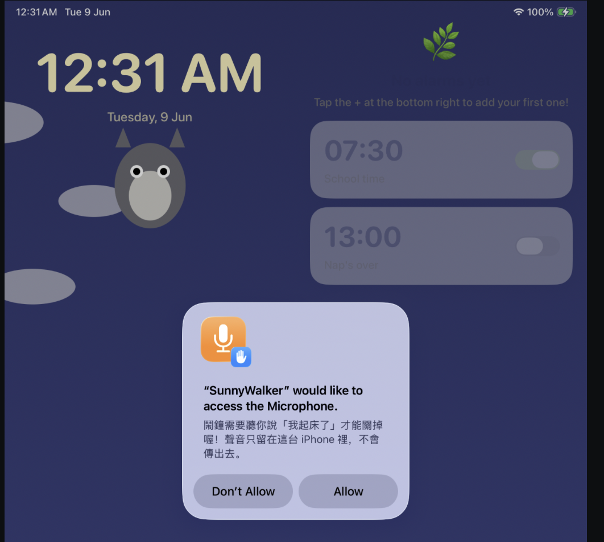
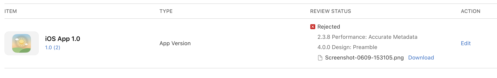

# 2026-06-04 fist submitted
Date Submitted
Jun 4, 2026 at 1:01 PM

# 2026-06-09
Hello, 

Thank you for submitting the new app, SunnyWalker, for review. We noticed some issues that require your attention. Please see below for additional information.

If you have any questions, we are here to help. Reply to this message in App Store Connect and let us know.

Review Environment
Submission ID: 8fa0d89a-a699-45fa-843a-189301c53e3b
Review date: June 09, 2026
Review Device: iPad Air 11-inch (M3)
Version reviewed: 1.0 (2)

Guideline 4 - Design

Issue Description

There are issues with the app's user interface that contribute to a lower-quality user experience than App Store users expect. Specifically, the app includes permissions requests that are not written in the same language as the app's localization.

Next Steps

Revise the app to address all instances of the issues identified above.

Note that users expect apps they download to function on all the devices where they are available. For example, apps that may be downloaded onto iPad devices should function as expected for iPad users. Learn more about supporting apps on compatible devices.

Resources

- Learn more about App Store design requirements in guideline 4. 
- Learn foundational design principles from Apple designers and the developer community.
- Visit Accessibility on iOS to learn more about delivering a superior mobile experience to every customer.
Guideline 2.3.8 - Performance - Accurate Metadata

Issue Description

We noticed the app subtitle to be displayed on the App Store includes the term for kids, which implies that this app is made specifically for children. However, this app was not submitted as a Kids category app.

Next Steps

To resolve this issue, please remove any terms from the app name, subtitle, icon, or screenshots that imply the main audience of this app is children. 

If the app is made exclusively for children, please select "Made for Kids" in the Rating section of App Store Connect.

Resources

For more information on assigning categories to the app, you may want to review the Choosing a Category page on the Apple Developer website.

For more information on the Kids category and its requirements, you may want to review the Building Apps for Kids page on the Apple Developer website.
Support
- Reply to this message in your preferred language if you need assistance. If you need additional support, use the Contact Us module.
- Consult with fellow developers and Apple engineers on the Apple Developer Forums.
- Provide feedback on this message and your review experience by completing a short survey.

