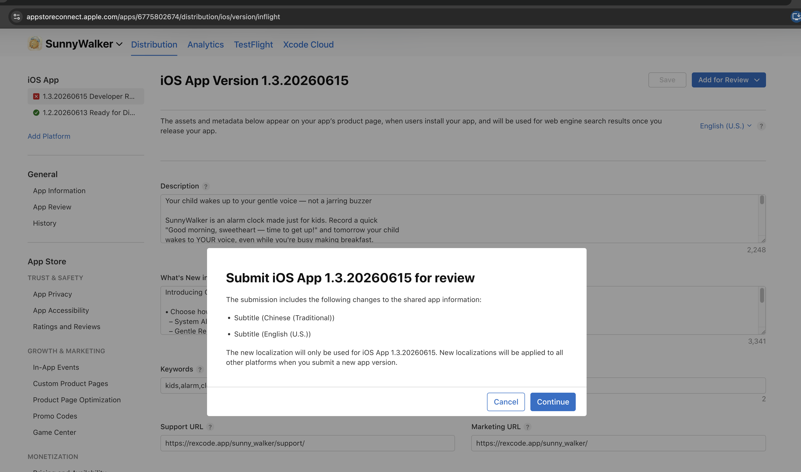
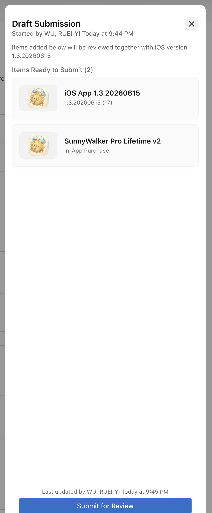
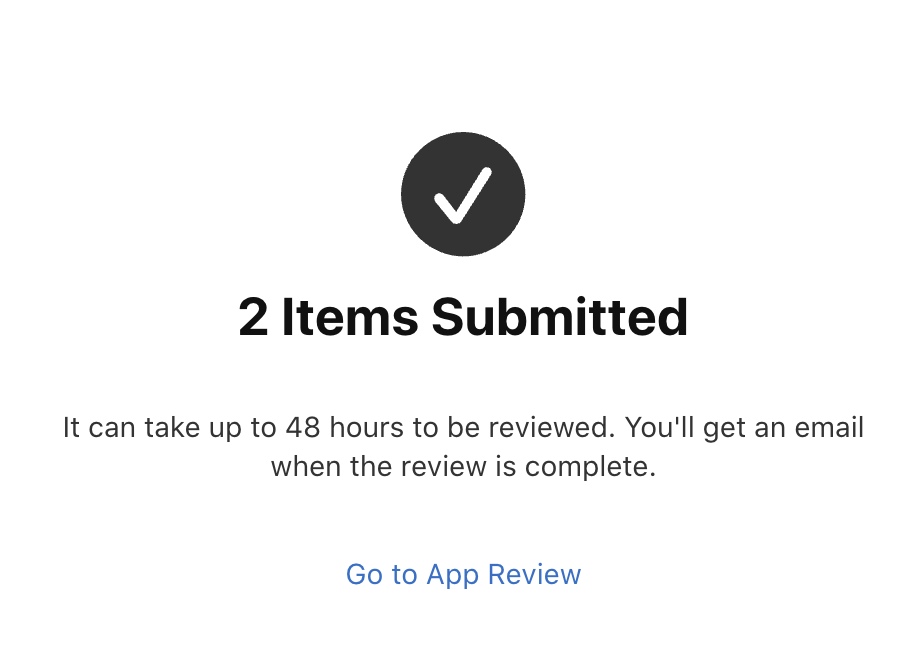
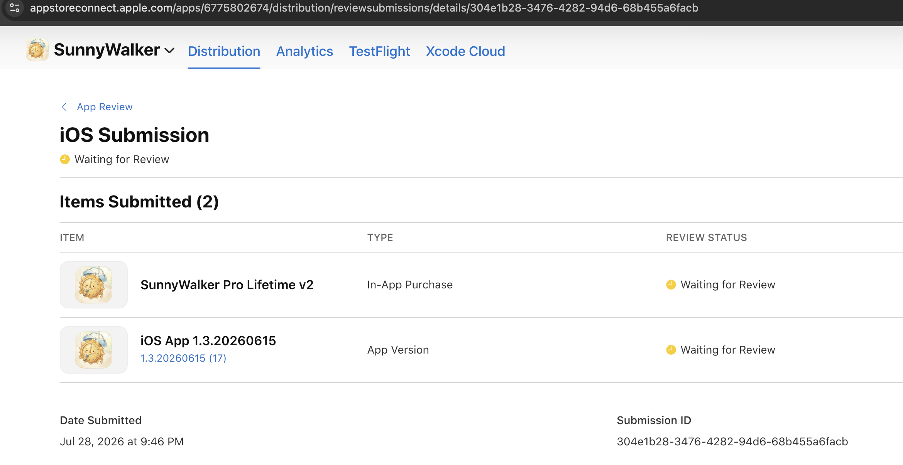

# App Review 被拒修正單（260728）— 第三次 2.1(b)，這次用「驗收制」走完

- Review date：July 27, 2026／Version reviewed：1.3.20260615 (**16**)
- 被拒條款：Guideline 2.1(b)——與 07-17 **一字不差**：「IAP 商品未送審」＋「必須提供 App Review screenshot 才能送 IAP」。
- 性質：**還是 ASC 後台流程沒走完**。binary 本身沒有新問題（reviewer 只卡 IAP）。

---

## 根因判讀

同樣的訊息出現第二次、且再次點名 screenshot → 最可能的斷點（按機率排）：

1. **v2 商品的 Review Screenshot 仍未上傳（或上傳後沒按 Save）** → 商品停在
   「Prepare for Submission」，從未到「Ready to Submit」。
2. **商品沒被掛進版本**：版本頁的「App 內購買項目」區塊**只有在商品狀態 =
   Ready to Submit 時才選得到它**——上一步沒完成，這一步就根本做不了，然後版本
   照樣 Submit 出去 → 又中 2.1(b)。
3. 修正一個之前的說法：商品頁右上的「Add for Review」按鈕**不是**掛進版本的動作。
   **唯一可信的完成判準 = 版本頁上看得到這顆 IAP 列在「App 內購買項目」區塊裡。**

> 這次不要用「我做過了」當判準，每一步都以「畫面上看到什麼」驗收。

---

## 執行清單（順序不能換，每步有驗收條件）

### Step 1 — 完成 v2 商品（營利 → App 內購買項目 → SunnyWalker Pro Lifetime v2）

| # | 動作 | ✅ 驗收：畫面上必須看到 |
|---|---|---|
| 1a | Family Sharing → Turn On | Family Sharing 顯示「已開啟」 |
| 1b | 確認價格 | Price Schedule 顯示 US$1.99 |
| 1c | Localizations（若還沒加） | 列表有 zh-Hant + en-US 兩列（文案見附錄 A） |
| 1d | **Review Information → Screenshot 上傳** | 縮圖出現在 Screenshot 欄（不是 Choose File 空框） |
| 1e | Review Notes 貼附錄 B | 欄位有文字 |
| 1f | **按 Save** | Save 鈕反灰（=已存檔）。⚠️ 新版 ASC 狀態會一直顯示 `Prepare for Submission` 直到掛進版本送審——**不用等它變**（「Ready to Submit」是舊版叫法），metadata 齊了就直接進 Step 2/3 |

**1d 的截圖規格**：build 16 或 17 的購買頁（ProUpgradeView），畫面要看得到
「10 on the free version」（**不能用舊的寫 6 那張**）、價格、購買鈕、Restore。
iPad 原生截圖直接傳（尺寸寬鬆）。

（2026-07-28 已確認：截圖、Notes、Family Sharing、價格、兩語 localization 全部完成，Step 1 結案。）

### Step 2 — Archive & Upload build 17

Apple 明講要新 binary，這次不賭「重送同顆」。build 17 已備好：
**分支 `hotfix/1.3-b17`（commit `f15238d`）＝被審過的 build 16 完全同內容、只換 build 號。**

```bash
cd ~/Documents/SunnyWalker && git switch hotfix/1.3-b17
open SunnyWalker.xcodeproj
# Any iOS Device → Product → Archive → 確認 1.3.20260615 (17) → Distribute → Upload
```

✅ 驗收：ASC → TestFlight 頁籤看到 build 17 處理完成。

### Step 3 — 版本頁（App Store → 1.3.20260615）

| # | 動作 | ✅ 驗收 |
|---|---|---|
| 3a | Build 區塊：移除 16 → 掛 **17** | Build 區塊顯示 (17) |
| 3b | **「App 內購買項目」區塊 → ＋ → 勾 SunnyWalker Pro Lifetime v2** | **版本頁上看得到這顆 IAP 被列出**（整個流程的核心驗收點） |
| 3c | 若找不到這個區塊或選不到商品 | = 商品 metadata 仍有缺（回商品頁找紅字/空欄），或試著重新整理版本頁 |

### Step 4 — 回信（附錄 C）→ Submit for Review

✅ 最終驗收：Submit 後的 submission 摘要頁應同時列出 **app 版本＋IAP 商品**兩個項目。
只有 app 沒有 IAP = 又會中 2.1(b)，不要按出去。

### 若這樣還被退

退件信有提供 **Meet with Apple 預約**（週二/週四）。第四次同題就直接約，
請 reviewer 當場看你的 ASC 畫面指出缺哪格——比再猜一輪快。

---

## 為什麼 build 17 不帶 TipJarKit（07-24 已接入 hotfix/1.3-b15）

- TipJarKit 需要 **3 檔 tip Consumable 商品**（`app.rexcode.sunnywalker.tip.*`）在 ASC
  建立＋各自完成 metadata/截圖＋一起掛進版本，等於把「這三週一直沒走完的流程」×4 份。
- 目前這個 submission 已連退 5 次，目標是**用最小變因結案**。TipJarKit 的
  「查無 ASC 商品自動隱藏」設計讓它下一版再上完全無痛。
- **下一版帶 TipJar 送審時的完整清單**（先記著）：3 檔 tip Consumable 各要
  Reference Name／Product ID（`…tip.small/medium/large` 以 code 為準）／價格／
  兩語 localization／各一張 Review Screenshot（家長頁 TipJarSection 畫面）／
  和版本一起掛進「App 內購買項目」區塊。Consumable 打賞放家長閘後，符合 Kids 規範。

---

## 附錄 A — IAP Localizations（Display Name ≤30 字、Description ≤45 字）

- zh-Hant：`SunnyWalker Pro`／`終身解鎖：鬧鐘、鈴聲、錄音全部無上限。一次購買永久使用。`
- en-US：`SunnyWalker Pro`／`Lifetime unlock: unlimited alarms & clips.`

## 附錄 B — IAP Review Notes

```
SunnyWalker Pro is a one-time, non-consumable lifetime unlock that removes the
free-tier limits (number of alarms, saved voice clips, clip length, and parent
recording length). Family Sharing is enabled.

How to locate it in the app: on the main screen tap the gear (Settings) button,
pass the parental gate (a multiplication question - a Kids Category requirement,
Guideline 1.3), then scroll to the bottom of Settings and tap the "SunnyWalker
Pro" row, which shows the localized price and opens this purchase sheet. A
"Restore Purchases" option is on the same sheet.
```

## 附錄 C — 回信草稿（純 ASCII）

```
Hello,

Thank you for your patience. We have now completed the In-App Purchase
submission end to end:

1. The non-consumable product "SunnyWalker Pro" (product ID:
app.rexcode.sunnywalker.pro.lifetime2) now has its App Review screenshot and
complete metadata, and its status is Ready to Submit.

2. The product is attached to this version's submission together with the new
binary (build 17).

To locate the purchase in the app: on the main screen tap the gear (Settings)
button, pass the parental gate (a multiplication question, per the Kids
Category requirements), then scroll to the bottom of Settings and tap the
"SunnyWalker Pro" row, which shows the localized price.

Please let us know if anything else is needed.

Thank you.
```

---

## 完成檢查（總表）

- [x] v2 商品 metadata 全齊（截圖/Notes/Family Sharing/價格/兩語，07-28 已確認；狀態顯示 Prepare for Submission 是新版 UI 正常現象）
- [x] build 17 已上傳（來自 `hotfix/1.3-b17`）
- [x] 版本頁掛 build 17
- [x] IAP 與版本同籃（Draft Submission 顯示 2 Items）
- [x] **07-28 21:46 已送出：Submission `304e1b28`，Items Submitted (2)——版本 (17) + Pro v2 都 Waiting for Review**
- [x] 回信已貼（21:33，於原 submission 訊息串；訊息歷史 reviewer 看得到）
- [ ]（過審後）真機正式 Apple ID 測購買 + Restore + 家庭共享；確認 grandfather 在 production 正常

### 過程補記（07-28 晚間實戰）
- 第一次按送出時只送了版本（1 Item）→ 立刻撤回（Removed，不算被拒）→ 重建籃子。
- 新版 ASC 送審模型：版本頁/商品頁的「Add for Review」= 把該項目加進 Draft Submission；
  **送出前唯一驗收 = 籃子顯示 2 Items**。三顆 Tip draft 留著沒送，不影響（build 17 未引用）。





