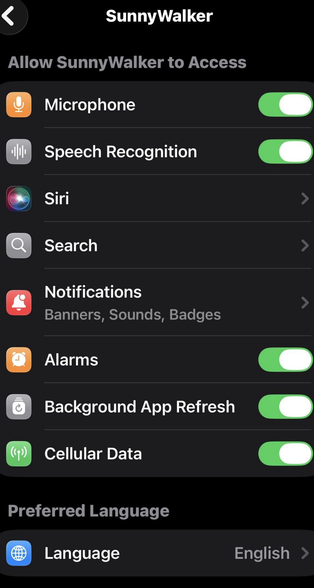

# 提醒模式（Time-Sensitive 通知）關屏關 app 完全沒反應 — 除錯交接文件

> 日期：2026-06-12
> 狀態：🟢 **已找到根因，待重 build 驗證**（見 §9）— 原狀態：通知已正確排程（`UN pending=7`）但「關屏 + 上滑殺 app」後到點什麼都不出現（無橫幅、無聲音）
> 撰寫目的：交接給另一個 AI / 工程師接手。以下完整記錄背景、已做的修改、實測 log、目前卡點與待驗證假設。
> 相關檔案：`Services/AlarmKitService.swift`、`Services/AlarmScheduler.swift`、`Services/AlarmAutoStopService.swift`、
> `Services/PermissionManager.swift`、`Views/Home/HomeView.swift`、`Views/Settings/AlarmEditorView.swift`、
> `Models/Alarm.swift`、`SunnyWalkerApp.swift`、`project.yml`、`SunnyWalker.entitlements`
> 背景文件：`issue/ALARM_AUTO_STOP.md`、`issue/fix_issue_autostop_keepalive.md`

---

## 0. TL;DR（給接手者）

- 產品是「給小朋友的提醒型鬧鐘」。原本用 **AlarmKit（iOS 26 系統鬧鐘）**，問題是：使用者把 app **上滑 force-quit** 後，AlarmKit 仍由系統無限響，app 端沒有任何機制能自動停 → 一直響、耗電。**這是 iOS 平台限制（AlarmKit 沒有 ring-duration API，也沒有喚醒被殺 app 的 callback）。**
- 為此新增 **per-alarm「提醒模式」**：該鬧鐘改用 **Time-Sensitive `UNNotification`**（響一次、自動停、省電），不走 AlarmKit。
- **目前卡點：** 提醒模式的鬧鐘，「關屏 + 上滑殺 app」後**完全沒反應**。log 證實通知**已正確排程且存活**（`🔬 UN pending=7`），但到點 iOS 沒有顯示它（沒橫幅、沒聲音）。
- **最大嫌疑：通知授權（UNUserNotificationCenter 的 alert/sound）未開**——因為 app 一直用 AlarmKit，UNNotification 路徑過去從沒真的顯示過，所以「沒授權 / 聲音關掉」一直沒被發現。**但尚未取得 `authStatus` 那行 log 來證實。**

---

## 1. 平台事實（已查證，WWDC25 / Apple docs / 開發者論壇）

| 事實 | 說明 |
|------|------|
| AlarmKit `AlarmManager.stop(id:)` 才會讓正在響的鬧鐘靜音；`cancel(id:)` 只移出排程 | 停正在響的鬧鐘要用 stop() |
| AlarmKit 鬧鐘由 SpringBoard 播放 | app suspended/被殺時，app 端收不到任何 callback |
| AlarmKit **沒有** ring-duration / auto-timeout API（iOS 26.x） | 「響 N 分鐘自動停」只能 app 自己保活算時間 |
| AlarmKit **沒有**「鬧鐘開始響時喚醒被殺 app」的 callback | `stopIntent` 只在使用者按按鈕才跑；連使用者滑掉鬧鐘 app 都收不到 |
| `applicationWillTerminate` 只在「app 還在背景活著時被外部殺掉」才送達 | 純 suspend / iOS 回收 suspended app 不會送。看到它＝**使用者上滑 force-quit**（log 已證實） |
| `.timeSensitive` 通知能突破 專注模式/勿擾，但**突破不了實體靜音開關** | 破靜音需 `.critical` interruptionLevel + Apple 特別審核的 entitlement |
| 自訂通知音效 ≤30 秒（否則 fallback 預設音），且**只播一次** | 這正是提醒模式「自動停」的原理 |
| **本地通知 force-quit 後仍會送達**（只要有授權） | 這是本案的關鍵矛盾點：理論上該響，實測沒響 → 指向授權問題 |

---

## 2. 已完成的修改

### 2-A. fix①（AlarmKit 模式的可靠性，**已真機驗證成功**）

「純鎖屏、未殺 app」時，原本 keep-alive 的靜音音訊是在 `await syncAllEnabled`（多次 AlarmKit IPC）**之後**才啟動，那段空窗沒有正在播放的音訊 → `audio` background mode 未生效 → app 可能在 keep-alive 啟動前就被 iOS suspend/terminate。

**修法：** 進背景的 keep gate 內**同步、最先**啟動靜音 keep-alive（`AlarmAutoStopService.ensureKeepAliveAudioNow()`，在 `HomeView` scenePhase→background 的保留分支呼叫）。
**驗證 log（成功）：** `interruption BEGAN → recoverPlayback RECOVERED on attempt 3 → DispatchTimer fired → stop AFTER=scheduled`。
→ **app 不被殺**就會準時自動停。但 force-quit 仍無解（見下）。

### 2-B. 新增 per-alarm「提醒模式」（**本文件主角，未解**）

目標：讓使用者可逐顆鬧鐘選擇背景策略，預設 AlarmKit，可切換成 Time-Sensitive 通知。

1. **`Models/Alarm.swift`**
   - 新增 `enum AlarmBackgroundMode: String, Codable { case alarmKit, notification }`
   - 新增 `var backgroundRingMode: AlarmBackgroundMode? = nil`（optional + default nil，SwiftData lightweight migration 安全）
   - 新增 `var effectiveBackgroundMode: AlarmBackgroundMode { backgroundRingMode ?? .alarmKit }`

2. **`Views/Settings/AlarmEditorView.swift`**
   - 編輯頁最下面加 `backgroundModeCard`（Toggle，對齊「啟用口令關閉」樣式）。`@State useNotificationMode`，預設 false=AlarmKit。
   - `saveAlarm()` 寫入 `tempAlarm.backgroundRingMode = useNotificationMode ? .notification : .alarmKit`。
   - 儲存時呼叫 `AlarmScheduler.shared.schedule(alarm: tempAlarm)`（前景，可靠）。

3. **`Services/AlarmScheduler.swift`**（UNNotification 排程器）
   - 原本：`guard !AlarmKitService.shared.isAuthorized else { return }`（AlarmKit 授權時整個 stand down）。
   - 改成：`let isNotificationMode = alarm.effectiveBackgroundMode == .notification` → `guard isNotificationMode || !isAuthorized else { return }`，讓提醒模式即使 AlarmKit 授權也會排通知。
   - 設定 `content.interruptionLevel = .timeSensitive`。
   - 開頭加授權診斷 log：`🚦 AlarmScheduler: UN authStatus=… alert=… sound=… lockScreen=…`（呼叫 `await center.notificationSettings()`）。
   - 排程方式：weekdays 非空 → 每個 weekday 一個 `UNCalendarNotificationTrigger(dateMatching: {weekday,hour,minute}, repeats: true)`，identifier=`"<uuid>-<weekday>"`。

4. **`Services/AlarmKitService.swift`**
   - `syncAlarm()`：若 `effectiveBackgroundMode == .notification` → `manager.stop()+cancel()`（移除 AlarmKit 條目）+ `AlarmAutoStopService.disarm()`，**然後 return**。
     - ⚠️ **重要修正：** 這裡【故意不】再呼叫 `AlarmScheduler.schedule()`（理由見 §3 第二輪）。
   - `syncAllEnabled()`：只有 `effectiveBackgroundMode == .alarmKit` 的鬧鐘才加進 `successIDs`（successIDs 之後會 `AlarmScheduler.cancel()` 清掉 UN）。否則會把提醒模式的通知清掉。

5. **`Views/Home/HomeView.swift`**
   - `checkForegroundAlarm()`：對 `.notification` 模式 `continue`（前景交給通知的 `willPresent` banner+sound，不另彈 in-app AlarmRingView，避免雙重音效）。
   - `.task(id: alarms.count)` 的 AlarmKit-authorized 分支：**前景啟動時補排**提醒模式的通知（`for alarm where effectiveBackgroundMode == .notification { schedule }`）。理由：背景不排（見 §3），靠前景補。

6. **`Services/AlarmAutoStopService.swift`**
   - `logLifecycleForensics()` 加印通知授權狀態：`🔬 UN authStatus=… alert=… sound=… lockScreen=… timeSensitive=…`（每次進背景/回前景都會印）。

7. **entitlement（`.timeSensitive` 需要）**
   - `SunnyWalker.entitlements` 加 `com.apple.developer.usernotifications.time-sensitive = true`（可自動佈建，與不可加的 alarmkit 不同）。
   - `project.yml` 設 `CODE_SIGN_ENTITLEMENTS: SunnyWalker/SunnyWalker.entitlements`。
   - ⚠️ 改了 project.yml 需 `xcodegen generate`。若 signing 報錯可移除回原狀（`.timeSensitive` 會降級但不 crash）。

---

## 3. 除錯歷程與實測 log

### 第一輪：發現 force-quit 是根因
關屏關 app 後 AlarmKit 黑標一直響不停。log：
```
🚦 keepAliveNeededNow=true — nearest fire in 36s
🏠 ...KEEPING keep-alive audio session...
🔬 AppDelegate.applicationWillTerminate — app 正在被終止
```
→ 使用者上滑 force-quit，process 被殺，app 端無法自動停 AlarmKit。**平台限制。** 於是新增「提醒模式」用通知規避。

### 第二輪：提醒模式「什麼都沒發生」之一 — 背景排程被 kill race 清掉
```
🔔 AlarmScheduler: NOTIFICATION-mode alarm 442D51AF — scheduling .timeSensitive UNNotification
🔔 AlarmScheduler: using CUSTOM banner sound → alarm_...caf
🔬 AppDelegate.applicationWillTerminate — app 正在被終止
```
分析：通知是在「進背景 `syncAlarm`」時排，而 `schedule()` 會先 `removePendingNotificationRequests()` 再 async `center.add()`；上滑 force-quit 卡在「已 remove、未 add 完成」中間 → 通知被清又沒補回。
**修法：** 提醒模式只在【前景】排（編輯頁儲存 / 清單開關 / `HomeView.task` 啟動補排）；`syncAlarm` 的 `.notification` 分支不再 `schedule()`；背景永不 remove-readd。

### 第三輪：提醒模式「什麼都沒發生」之二 — 通知已存活但仍不顯示（**目前卡在這**）
重 build 後再測，log：
```
🚦 keepAliveNeededNow=false — no upcoming armed alarms (total armed=0)
🏠 HomeView.scenePhase → background: released mic + audio session ... (prevCategory=AVAudioSessionCategorySoloAmbient)
AlarmKitService.syncAlarm: 442D51AF → NOTIFICATION mode; AlarmKit removed, UNNotification left intact (scheduled in foreground)
AlarmKitService: bulk sync complete — 0/1 synced to AlarmKit
🔬 Forensics[entering-background] now=12:09:23
🔬   lastHeartbeat   =11:26:00 (2603s ago) phase=dispatch-fire
🔬   willTerminate   =11:49:08 (1215s ago)
🔬   armedAlarms=0
🔬   UN delivered=0 ids=[]
🔬   UN pending=7 ids=["442D51AF-..-1", "..-2", "..-3", "..-4", "..-5", "..-6", "..-7"]   ← 通知確實排好且存活
🔬 AppDelegate.applicationWillTerminate — app 正在被終止 2026-06-12 04:09:24 +0000
```
**關鍵：`UN pending=7` 證明 7 顆（每 weekday 一顆、repeats:true）通知已正確註冊且撐過 kill。排程問題已解。**
**但「關屏 + 上滑殺 app」到點仍完全沒反應（無橫幅、無聲音）。**

---

## 4. 目前未解的問題（給接手 AI 的核心問題）

> **已正確排程（`pending=7`、repeats:true、含今天 weekday）的 Time-Sensitive 本地通知，在「關屏 + 上滑 force-quit」後，到點完全不顯示（無橫幅無聲音）。本地通知理論上 force-quit 後仍會送達。為什麼沒有？**

對比現象（很重要）：
- **AlarmKit 模式** force-quit 後**會**在鎖屏顯示系統鬧鐘 UI（第一輪的「slide to stop」截圖）。
- **通知模式** force-quit 後**完全不顯示**。
- 兩者都是「系統層」觸發、不需 app 活著。這個不對稱指向「通知本身沒被系統顯示」，最可能是授權。

---

## 5. 待驗證假設（依可能性排序）

### 假設 A（最可能）：UNUserNotificationCenter 授權未開 / 聲音被關
- app 一直用 AlarmKit（有自己的授權），UNNotification 路徑過去只在「AlarmKit 未授權」時才跑，所以從沒真的顯示過通知 → 使用者可能在某次把通知權限拒掉、或「聲音」關掉，一直沒被發現。
- `requestAllPermissions()`（`PermissionManager`，每次啟動跑，但 `requestAuthorization` 只第一次會跳框；之前拒絕過就靜默回 false）。
- **待取得的決定性 log：** 啟動時的 `🔔 NotifSettings: authStatus=… sound=… alert=…`，或新加的 `🔬 UN authStatus=…`。
  - `authStatus` 需 = `2`(authorized)；`alert`/`sound` 需 = `2`(enabled / 在舊 enum 是 `.enabled`)。
  - 若不是 → **設定 ▸ SunnyWalker ▸ 通知** 把「允許通知 + 聲音 + 鎖定畫面」全開，或程式需處理 denied 狀態。
- **尚未證實**：使用者目前還沒貼出 `authStatus` 那行。

### 假設 B：iPad 在實體靜音狀態
- `.timeSensitive` 破不了實體靜音開關 → 靜音時「有橫幅、沒聲音」。
- 但使用者說「**什麼都沒有**」（連橫幅都沒有），若屬實，靜音無法解釋「沒橫幅」→ 較不像 B，較像 A。
- 仍需確認：使用者描述的「什麼都沒有」是否包含「鎖屏連橫幅都沒出現」。

### 假設 C：`.timeSensitive` entitlement 未真的進 binary
- 若 `xcodegen generate` 沒跑 / signing 把 entitlement 拿掉，`.timeSensitive` 會降級成 `.active`。
- **但降級不會讓通知消失**，只是不破專注模式 → **無法解釋「完全沒反應」**。可排除為主因，但仍值得確認 entitlement 有進 build。

### 假設 D：測試時間點問題（weekday repeats 語意）
- 7 顆通知是「每 weekday 一顆、repeats:true」。某天只有「今天 weekday」那顆會在今天的 H:M 響；若該 H:M **今天已過**，要等下週同一天。
- 若使用者用一顆固定時間（log 出現過 11:50）的鬧鐘，在 12:09 測 → 今天的 11:50 已過 → 今天不會響。
- **需確認**：測試時鬧鐘的 H:M 是否真的設在「當下之後 1～2 分鐘」、且那顆 weekday 是今天。

### 假設 E：通知內容/觸發本身有問題
- 自訂音效 CAF >30 秒會 fallback 預設音，但**仍會顯示橫幅** → 無法解釋「完全沒反應」。
- `UNCalendarNotificationTrigger` 元件正確（weekday+hour+minute, repeats:true），但值得再核對。

---

## 6. 建議的下一步實驗（隔離問題）

1. **先取得授權狀態**：重 build → 啟動 → 看 log 的 `🔔 NotifSettings:` 或進背景的 `🔬 UN authStatus=`。一行定生死。
2. **最小重現**：寫一個臨時測試鈕，排一個 `UNTimeIntervalNotificationTrigger(timeInterval: 10, repeats: false)` + `content.sound = .default` + `.timeSensitive`，然後：
   - (a) app 留前景 → 看 `willPresent` 是否出 banner+sound；
   - (b) 切背景不殺 → 10 秒後看是否出現；
   - (c) 上滑殺 app → 10 秒後看是否出現。
   - 若 (a)(b) 出、(c) 不出 → force-quit 特有問題（少見，需深查）。若全不出 → **授權**（假設 A 成立）。
3. **確認測試時間**：把鬧鐘設成「現在 +2 分鐘」，確保今天 weekday 那顆會在測試窗內觸發。
4. **確認 entitlement**：`xcodegen generate` 後，檢查 `.xcodeproj` 的 `CODE_SIGN_ENTITLEMENTS` 是否指到 entitlements 檔、build 後 binary 是否含 time-sensitive。

---

## 7. 關鍵程式位置速查

- 排通知：`Services/AlarmScheduler.swift` → `schedule(alarm:)`（guard、`interruptionLevel`、weekday trigger、授權診斷 log）。
- 模式分流：`Services/AlarmKitService.swift` → `syncAlarm()` 的 `.notification` 分支、`syncAllEnabled()` 的 successIDs 過濾。
- 前景補排：`Views/Home/HomeView.swift` → `.task(id: alarms.count)` authorized 分支。
- 前景不彈 in-app ring：`Views/Home/HomeView.swift` → `checkForegroundAlarm()` 的 `.notification` continue。
- 授權請求：`Services/PermissionManager.swift` → `requestNotificationPermission()`（`[.alert,.sound,.badge]`）、`logNotificationSettings()`。
- 授權請求觸發點：`SunnyWalkerApp.swift` → `ContentView().task { requestAllPermissions() }`（每次啟動）。
- 前景通知顯示：`SunnyWalkerApp.swift` → `willPresent` 回 `[.banner, .sound]`。
- 模型：`Models/Alarm.swift` → `AlarmBackgroundMode` / `effectiveBackgroundMode`。
- UI：`Views/Settings/AlarmEditorView.swift` → `backgroundModeCard` / `saveAlarm()`。
- entitlement：`SunnyWalker.entitlements` + `project.yml`（`CODE_SIGN_ENTITLEMENTS`）。

---

## 8. 注意事項

- 開發環境 build 在使用者的 Mac（Xcode）。改了 `project.yml` 後必須 `xcodegen generate`（會用 `info.properties` 重建 Info.plist，背景模式等 key 已在 project.yml 內，安全）。
- 沒有新增 .swift 檔（都是改既有檔），所以不會有「Cannot find … in scope / 逐檔列舉的 pbxproj 漏檔」問題；但 `CODE_SIGN_ENTITLEMENTS` 是新設定，需 regenerate 才會進 pbxproj。
- AlarmKit 模式（預設）不受本問題影響；本問題只在「提醒模式」。


--- 
## iphone setting


---

## 9. 解答（2026-06-12，Claude 分析）

**根因：假設 C 成立，但後果比文件預期嚴重。**

排查鏈：
1. 使用者確認：測試時間有設成未來（排除 D）、無 Apple Watch、**設定 ▸ SunnyWalker ▸ Notifications 內頁沒有「Time Sensitive Notifications」開關** ← 決定性線索（開關不存在＝entitlement 不在 binary）。
2. 截圖顯示通知授權正常（Banners, Sounds, Badges）→ 排除 A。
3. `grep CODE_SIGN_ENTITLEMENTS SunnyWalker.xcodeproj/project.pbxproj` → **無結果**。`project.yml` 改了但 `xcodegen generate` 沒跑，entitlement 從沒進過 build。

**關鍵知識修正（§5 假設 C 的錯誤前提）：** entitlement 缺失時，標 `.timeSensitive` 的通知**不是降級**，而是被 iOS **整顆悄悄丟棄**——無橫幅、無聲音、不進 delivered 清單。完全吻合「pending=7、delivered=0、什麼都沒有」與「AlarmKit 會響（不走此路徑）」的不對稱。

**已做的修改：** `AlarmScheduler.swift` 加 runtime 防衛——讀 `ns.timeSensitiveSetting`，`!= .enabled`（0=notSupported=entitlement 缺、1=使用者關閉）時降回 `.active` 並印警告，通知至少正常顯示。診斷 log 也加印 `timeSensitive=` 欄位。

**待使用者執行：**
1. `cd ~/Documents/SunnyWalker && xcodegen generate`
2. `grep CODE_SIGN_ENTITLEMENTS SunnyWalker.xcodeproj/project.pbxproj` 確認 key 進了 pbxproj
3. 重 build 裝機 → 設定內頁應出現「Time Sensitive Notifications」開關；log 應見 `timeSensitive=2`
4. 鬧鐘設「現在+2分」→ 上滑殺 app → 鎖屏 → 應出現橫幅+聲音

**通用教訓：** 改 `project.yml` 的 build setting 後必跑 `xcodegen generate`，並 grep pbxproj 確認 key 真的進去。已寫入 Vein（pitfall 20260612-125817-3b9e）。
